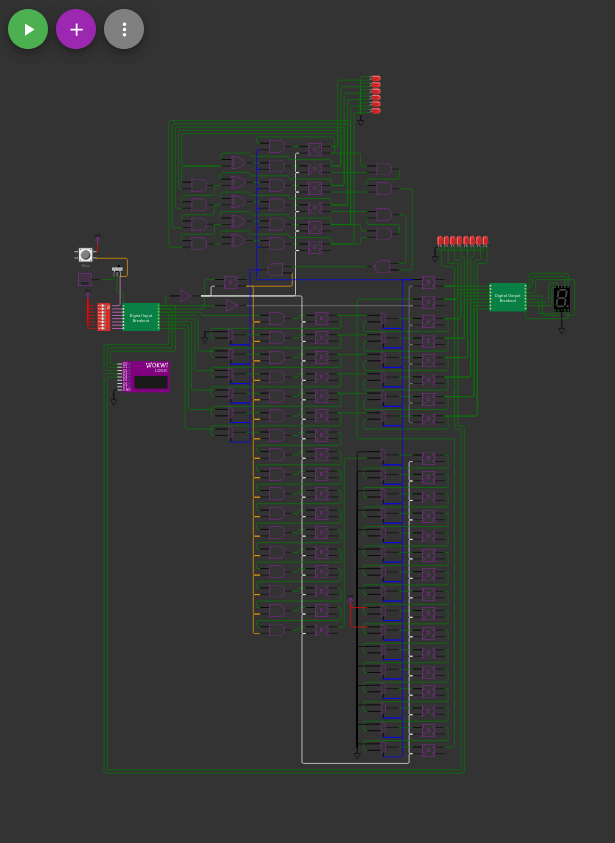

# SPI Flash State Machine

This implements a state machine using a external SPI flash. It has 5 inputs, 6 outputs and 10 internal state bits.

## Theory of Operation

This essentially implements 16x 15 input look up tables stored in external SPI flash.  6 of the LUTs drive general purpose outputs and the remaining 10 are looped back internally as state bits.  The inputs to the LUTs are 5 general purpose inputs and the 10 state bits.

The circuit sends out the read command 8'h03 followed by a 24 bit address consisting of {8'h00, [10 state bits], [5 GPI], 1'b0}.
The circuit then shifts in 2 bytes to read the LUT values.  The first 10 bits shifted in are the state bits and the next 6 drive the outputs.

## Circuit Diagram

## Contact

You can find me [online here](https://greg.steiert.net/)

***

 
